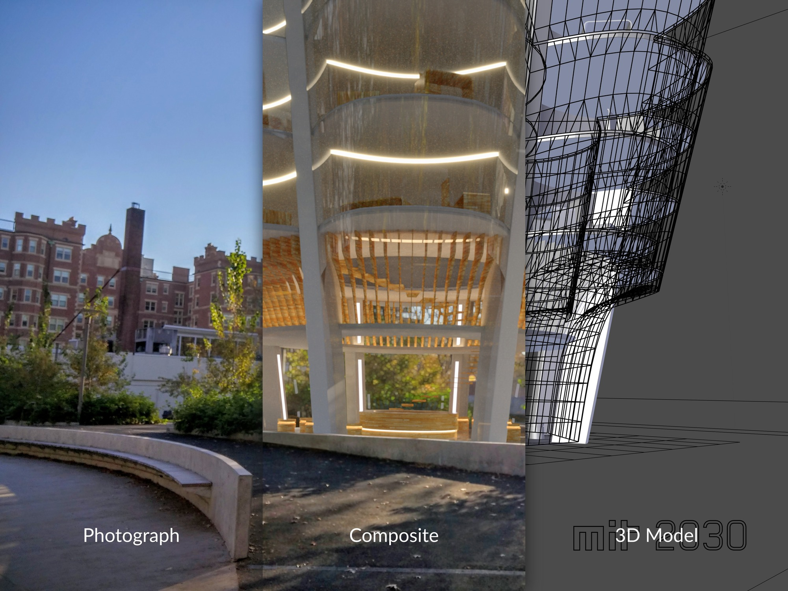
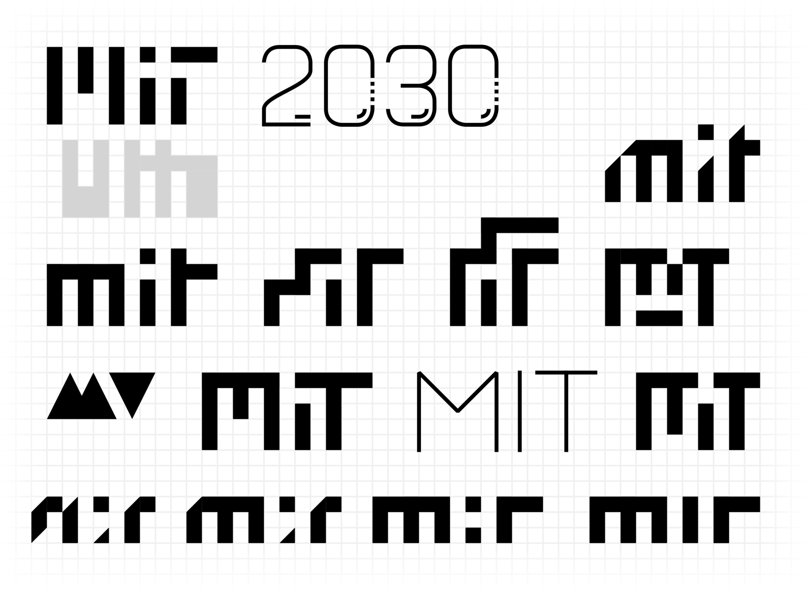

# MIT 2030

The built environment surrounds us. The places we eat, sleep, work, and play; clad in brick, concrete, wood, metal, and glass. Costing millions of dollars, each building takes years to design, then years more to construct. From conception to completion, it is critical that every project member is on the same page.

This is where an architectural rendering comes in. In the design phase of a building, especially when an architectural firm is working with a client, a pre-visualization of an otherwise abstract concept can help to sell a vision. Part sketch and part concept art, architectural renderings portray a potential future, an idea with the intent of realization.

MIT 2030 is my vision for a fictional future dorm in a speculative MIT, one embodying a refreshed set of values that I wished the present MIT had: more focus on creativity and the arts, a bustling cross-disciplinary community, and the drive to be different. Focusing less on technicalities and more on intellectual provocation, I chose a general timeframe of 15 years in the future to account for organizational changes, funding and licensing, design and construction, et cetera. I was mainly driven by questions in the form "what if?": What if MIT were modern, daring, and agile? What if MIT were founded today? *What would it look like?*

---

## Behind the Scenes

*DISCLAIMER: This personal project many not be representative of the views or plans of MIT.*

---

Learning Focus: Compositing, Realistic Rendering, Architectural Design, Logo Design

Media: Composite, Photograph, 3D Model, Vector Graphic

Software: Blender, Inkscape, GIMP

Date: November 2016
